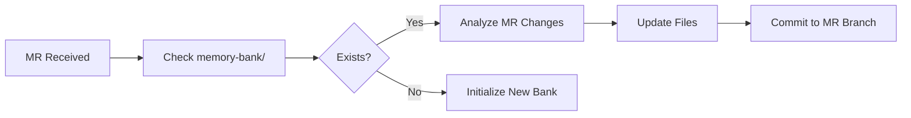

# New Review Types

This document describes the two new review types added to the AI Code Review System.

## 1. UNIT_TEST_COVERAGE (Обязательный)

### Purpose
Automatically checks if code changes are covered by unit tests and generates missing test code.

### What It Does

1. **Analyzes Test Coverage**:
   - Detects all changed files using `git diff`
   - Identifies corresponding test files
   - Checks if new methods/classes have tests
   - Validates test quality and completeness

2. **Generates Missing Tests**:
   - Creates complete, ready-to-use test code
   - Follows project conventions (naming, structure, base classes)
   - Uses modern testing frameworks:
     - JUnit 5
     - Mockito for mocking
     - TestContainers for integration tests
   - Extends project's `*Base` test classes if available:
     - `JupiterBase`
     - `JupiterArtemisBase`
     - `JupiterNuxeoBase`
     - etc.

3. **Test Scenarios Covered**:
   - Happy path (normal execution)
   - Edge cases (null values, empty collections, boundaries)
   - Error cases (exceptions, validation failures)
   - Business logic variants

### When It Runs

- **By default**: Always included in review process
- **Can be disabled**: Set `review_types` without `UNIT_TEST_COVERAGE`

### Output Format

```yaml
coverage_summary:
  total_files_changed: 5
  files_with_tests: 3
  files_without_tests: 2
  status: PARTIAL

missing_tests:
  - file: src/main/java/com/example/UserService.java
    test_file: src/test/java/com/example/UserServiceTest.java
    status: INCOMPLETE
    reason: "New method getUserById() has no tests"
    priority: HIGH
    
generated_tests:
  - test_file: src/test/java/com/example/UserServiceTest.java
    code: |
      @ExtendWith(MockitoExtension.class)
      class UserServiceTest extends JupiterBase {
          @Mock
          private UserRepository userRepository;
          
          @InjectMocks
          private UserService userService;
          
          @Test
          void shouldReturnUserWhenIdExists() {
              // Given
              Long userId = 1L;
              User expectedUser = new User(userId, "John Doe");
              when(userRepository.findById(userId)).thenReturn(Optional.of(expectedUser));
              
              // When
              User actualUser = userService.getUserById(userId);
              
              // Then
              assertThat(actualUser).isNotNull();
              assertThat(actualUser.getId()).isEqualTo(userId);
              verify(userRepository).findById(userId);
          }
      }
    scenarios_covered:
      - "Happy path: user exists"
      - "Error case: user not found"

recommendations:
  - "Use JupiterBase for all new tests"
  - "Consider TestContainers for repository tests"
```

### Configuration

In API request:
```json
{
  "project_id": 123,
  "merge_request_iid": 456,
  "review_types": ["ERROR_DETECTION", "UNIT_TEST_COVERAGE"]
}
```

### Prompts

- Cline: `prompts/cline/unit_test_coverage.md`
- Qwen: `prompts/qwen/unit_test_coverage.md`

---

## 2. MEMORY_BANK (Опциональный)

### Purpose
Initializes or validates a project's Memory Bank - a structured knowledge base for AI-assisted development.

### What Is Memory Bank?

Memory Bank is based on **Cursor's Memory Bank (v1.2 Final)** methodology. It's a collection of markdown files that provide comprehensive project context:

1. **projectbrief.md** - Project scope, objectives, and requirements
2. **productContext.md** - Why the project exists, problems it solves
3. **systemPatterns.md** - Architecture, design patterns, technical decisions
4. **techContext.md** - Technology stack, dependencies, setup
5. **activeContext.md** - Current work focus, recent changes, next steps
6. **progress.md** - What works, what's left, known issues

### What It Does

#### If Memory Bank Exists (PRIMARY MODE):
1. **Updates** Memory Bank with changes from current MR:
   - Analyzes MR changes via `git diff`
   - Updates `activeContext.md` with recent changes (MANDATORY)
   - Updates `systemPatterns.md` if architectural changes detected
   - Updates `techContext.md` if new dependencies/technologies added
   - Updates `progress.md` if features completed or status changed
   - Updates `changelog.md` with MR entry (MANDATORY)
   - **Commits changes back to MR branch** with `[skip ci]` tag

2. **Validates** all core files are present (validation mode - rare)
3. **Reports** status of each file
4. **Suggests** updates if files are outdated or incomplete

#### If Memory Bank Doesn't Exist:
1. **Analyzes** the entire project:
   - Repository structure
   - Build configuration (pom.xml, build.gradle)
   - Main application class
   - Key packages and modules
   - Existing documentation

2. **Identifies** technologies:
   - Programming language and version
   - Framework (Spring Boot, etc.)
   - Database
   - Build tool
   - Testing frameworks

3. **Creates** complete Memory Bank:
   - All 6 core files with actual project data
   - Optional files (changelog.md, tags_index.md)
   - Mermaid diagrams for architecture visualization

### When It Runs

- **Explicitly requested**: Include `MEMORY_BANK` in `review_types`
- **Optional**: Not part of default review flow
- **Recommended Usage**:
  - Run once per project to initialize
  - Include in every MR to update Memory Bank automatically
  - Run periodically for validation

### Operating Modes

1. **Update Mode (PRIMARY)**: When Memory Bank exists
   - Analyzes MR changes
   - Updates relevant Memory Bank files
   - Commits changes to MR branch
   - Use for: Every MR

2. **Initialize Mode**: When Memory Bank doesn't exist
   - Analyzes entire project
   - Creates complete Memory Bank structure
   - Use for: First time setup

3. **Validate Mode (RARE)**: When validation needed
   - Checks structure and completeness
   - Reports issues
   - Use for: Periodic audits

### Output Format

#### Update Mode (Primary - Memory Bank Exists):
```yaml
memory_bank_status: UPDATED
mr_analyzed: 123
files_updated:
  - file: activeContext.md
    changes: "Added recent changes for MR !123, updated current focus"
  - file: systemPatterns.md
    changes: "Documented new authentication pattern"
  - file: techContext.md
    changes: "Added Redis dependency"
  - file: progress.md
    changes: "Marked user authentication feature as completed"
  - file: changelog.md
    changes: "Added MR !123 entry"

update_summary:
  features_added:
    - "User authentication with JWT"
  patterns_introduced:
    - "Token-based authentication pattern"
  dependencies_added:
    - "Redis: 7.0"
  issues_resolved:
    - "Fixed null pointer in user service"

commits_made:
  - commit: "a1b2c3d"
    message: "docs: Update Memory Bank for MR !123 [skip ci]"
    files: ["memory-bank/activeContext.md", "memory-bank/changelog.md", ...]

recommendations:
  - "Consider adding authentication to productContext.md"
```

#### Validation Mode (Rare - Check Structure):
```yaml
memory_bank_status: EXISTS
validation_results:
  - file: projectbrief.md
    status: OK
    notes: "Contains project scope and requirements"
  
  - file: systemPatterns.md
    status: INCOMPLETE
    notes: "Missing recent architectural decisions"

recommendations:
  - "Update activeContext.md to reflect this MR"
  - "Add database optimization patterns to systemPatterns.md"
```

#### Initialize Mode (New Memory Bank):
```yaml
memory_bank_status: CREATED
files_created:
  - projectbrief.md
  - productContext.md
  - systemPatterns.md
  - techContext.md
  - activeContext.md
  - progress.md
  - changelog.md
  - tags_index.md

analysis_summary:
  project_type: "REST API Microservice"
  primary_technology: "Spring Boot 3.2"
  architecture_pattern: "Layered Architecture"
  key_features:
    - "Multi-agent code review system"
    - "GitLab integration"
    - "Automated MR creation"
  confidence: HIGH

recommendations:
  - "Review and refine projectbrief.md with product owner"
  - "Update activeContext.md as work progresses"
```

### Integration with Code Review

Memory Bank provides continuous context across all reviews:

1. **System Prompt** instructs all agents to check for `memory-bank/` directory
2. If found, agents read key files for context:
   - `projectbrief.md` - Project scope and objectives
   - `systemPatterns.md` - Architectural decisions
   - `techContext.md` - Technology stack
   - `activeContext.md` - Current focus
3. Recommendations align with documented decisions
4. **Memory Bank Agent** keeps it updated with each MR

### Auto-Update Workflow

When MEMORY_BANK agent runs on an MR:



**Commit Details**:
- Files: Only `memory-bank/*` files
- Message: `docs: Update Memory Bank for MR !{mr_iid} [skip ci]`
- Tag: `[skip ci]` to avoid triggering CI pipeline
- Push: To MR source branch (developer can review and merge)

### Configuration

In API request:
```json
{
  "project_id": 123,
  "merge_request_iid": 456,
  "review_types": ["MEMORY_BANK"]
}
```

Or combined with other reviews:
```json
{
  "project_id": 123,
  "merge_request_iid": 456,
  "review_types": ["ERROR_DETECTION", "BEST_PRACTICES", "MEMORY_BANK"]
}
```

### Prompts

- Cline: `prompts/cline/memory_bank.md`
- Qwen: `prompts/qwen/memory_bank.md`

### Benefits

1. **Faster Onboarding**: New developers understand project quickly
2. **Consistent Reviews**: AI agents use project context for better recommendations
3. **Knowledge Preservation**: Architectural decisions and rationale are documented
4. **Living Documentation**: Updates as project evolves
5. **AI-Friendly**: Structured format optimized for AI comprehension

---

## Summary

| Review Type | Required | Purpose | When to Use |
|------------|----------|---------|-------------|
| **UNIT_TEST_COVERAGE** | ✅ Yes | Ensure code changes have tests | Every MR |
| **MEMORY_BANK** | ❌ Optional | Initialize/validate project knowledge base | Once per project, then periodically |

## Related Documentation

- [System Prompt Guide](SYSTEM_PROMPT_GUIDE.md) - How system prompt works
- [Prompts Guide](PROMPTS_GUIDE.md) - How to customize prompts
- Memory Bank Template: See `prompts/cline/memory_bank.md` or `prompts/qwen/memory_bank.md`

