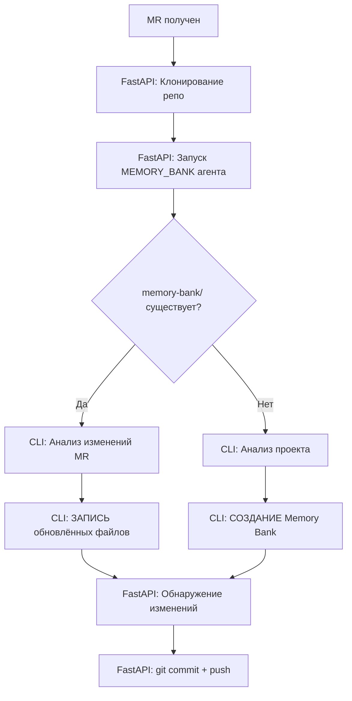

# Новые типы ревью

Этот документ описывает два новых типа ревью, добавленных в систему AI Code Review.

## 1. UNIT_TEST_COVERAGE (Обязательный)

### Назначение
Автоматически проверяет покрытие изменений кода юнит-тестами и генерирует недостающий код тестов.

### Что делает

1. **Анализирует покрытие тестами**:
   - Обнаруживает все изменённые файлы через `git diff`
   - Идентифицирует соответствующие файлы тестов
   - Проверяет наличие тестов для новых методов/классов
   - Валидирует качество и полноту тестов

2. **Генерирует недостающие тесты**:
   - Создаёт полный, готовый к использованию код тестов
   - Следует конвенциям проекта (именование, структура, базовые классы)
   - Использует современные фреймворки тестирования:
     - JUnit 5
     - Mockito для моков
     - TestContainers для интеграционных тестов
   - Наследуется от базовых тестовых классов проекта (если есть):
     - `JupiterBase`
     - `JupiterArtemisBase`
     - `JupiterNuxeoBase`
     - и т.д.

3. **Покрываемые тестовые сценарии**:
   - Happy path (нормальное выполнение)
   - Граничные случаи (null значения, пустые коллекции, границы)
   - Ошибочные случаи (исключения, ошибки валидации)
   - Варианты бизнес-логики

### Когда выполняется

- **По умолчанию**: Всегда включён в процесс ревью
- **Можно отключить**: Указать `review_types` без `UNIT_TEST_COVERAGE`

### Формат вывода

```yaml
coverage_summary:
  total_files_changed: 5
  files_with_tests: 3
  files_without_tests: 2
  status: PARTIAL

missing_tests:
  - file: src/main/java/com/example/UserService.java
    test_file: src/test/java/com/example/UserServiceTest.java
    status: INCOMPLETE
    reason: "Новый метод getUserById() не покрыт тестами"
    priority: HIGH
    
generated_tests:
  - test_file: src/test/java/com/example/UserServiceTest.java
    code: |
      @ExtendWith(MockitoExtension.class)
      class UserServiceTest extends JupiterBase {
          @Mock
          private UserRepository userRepository;
          
          @InjectMocks
          private UserService userService;
          
          @Test
          void shouldReturnUserWhenIdExists() {
              // Given
              Long userId = 1L;
              User expectedUser = new User(userId, "John Doe");
              when(userRepository.findById(userId)).thenReturn(Optional.of(expectedUser));
              
              // When
              User actualUser = userService.getUserById(userId);
              
              // Then
              assertThat(actualUser).isNotNull();
              assertThat(actualUser.getId()).isEqualTo(userId);
              verify(userRepository).findById(userId);
          }
      }
    scenarios_covered:
      - "Happy path: пользователь существует"
      - "Ошибочный случай: пользователь не найден"

recommendations:
  - "Используйте JupiterBase для всех новых тестов"
  - "Рассмотрите TestContainers для тестов репозиториев"
```

### Конфигурация

В API запросе:
```json
{
  "project_id": 123,
  "merge_request_iid": 456,
  "review_types": ["ERROR_DETECTION", "UNIT_TEST_COVERAGE"]
}
```

### Промпты

- Cline: `prompts/cline/unit_test_coverage.md`
- Qwen: `prompts/qwen/unit_test_coverage.md`

---

## 2. MEMORY_BANK (Опциональный)

### Назначение
Инициализирует или валидирует Memory Bank проекта - структурированную базу знаний для AI-разработки.

### Что такое Memory Bank?

Memory Bank основан на методологии **Cursor's Memory Bank (v1.2 Final)**. Это коллекция markdown файлов, предоставляющих полный контекст проекта:

1. **projectbrief.md** - Scope проекта, цели и требования
2. **productContext.md** - Почему проект существует, какие проблемы решает
3. **systemPatterns.md** - Архитектура, паттерны проектирования, технические решения
4. **techContext.md** - Технологический стек, зависимости, настройка
5. **activeContext.md** - Текущий фокус работы, недавние изменения, следующие шаги
6. **progress.md** - Что работает, что осталось сделать, известные проблемы

### Что делает

#### Если Memory Bank существует (ОСНОВНОЙ РЕЖИМ):
1. **Обновляет** Memory Bank изменениями из текущего MR:
   - **CLI Агент**:
     - Анализирует изменения MR через `git diff`
     - Определяет какие файлы нужно обновить
     - **ЗАПИСЫВАЕТ** обновлённое содержимое в файлы Memory Bank:
       - `activeContext.md` - недавние изменения (ОБЯЗАТЕЛЬНО)
       - `systemPatterns.md` - если есть архитектурные изменения
       - `techContext.md` - если добавлены новые зависимости/технологии
       - `progress.md` - если завершены функции или изменился статус
       - `changelog.md` - запись о MR (ОБЯЗАТЕЛЬНО)
     - Возвращает `files_modified` в JSON
   - **FastAPI**:
     - Обнаруживает изменённые файлы в `memory-bank/`
     - Стейджит: `git add memory-bank/`
     - Коммитит с тегом `[skip ci]`
     - Пушит в ветку MR

2. **Валидирует** наличие всех core файлов (режим валидации - редко)
3. **Отчитывается** о статусе каждого файла
4. **Предлагает** обновления если файлы устарели или неполные

#### Если Memory Bank не существует:
1. **Анализирует** весь проект:
   - Структура репозитория
   - Конфигурация сборки (pom.xml, build.gradle)
   - Главный класс приложения
   - Ключевые пакеты и модули
   - Существующая документация

2. **Идентифицирует** технологии:
   - Язык программирования и версия
   - Фреймворк (Spring Boot и т.д.)
   - База данных
   - Система сборки
   - Фреймворки тестирования

3. **Создаёт** полный Memory Bank:
   - Все 6 core файлов с реальными данными проекта
   - Опциональные файлы (changelog.md, tags_index.md)
   - Mermaid диаграммы для визуализации архитектуры

### Когда выполняется

- **По явному запросу**: Включить `MEMORY_BANK` в `review_types`
- **Опционально**: Не входит в стандартный процесс ревью
- **Рекомендуемое использование**:
  - Запустить один раз для инициализации проекта
  - Включать в каждый MR для автоматического обновления Memory Bank
  - Запускать периодически для валидации

### Режимы работы

1. **Режим обновления (ОСНОВНОЙ)**: Когда Memory Bank существует
   - Анализирует изменения MR
   - Обновляет соответствующие файлы Memory Bank
   - Коммитит изменения в ветку MR
   - Использовать для: Каждый MR

2. **Режим инициализации**: Когда Memory Bank не существует
   - Анализирует весь проект
   - Создаёт полную структуру Memory Bank
   - Использовать для: Первоначальная настройка

3. **Режим валидации (РЕДКО)**: Когда нужна валидация
   - Проверяет структуру и полноту
   - Отчитывается о проблемах
   - Использовать для: Периодические аудиты

### Формат вывода

#### Режим обновления (Основной - Memory Bank существует):
```yaml
memory_bank_status: UPDATED
mr_analyzed: 123
files_updated:
  - file: activeContext.md
    changes: "Добавлены недавние изменения для MR !123, обновлён текущий фокус"
  - file: systemPatterns.md
    changes: "Документирован новый паттерн аутентификации"
  - file: techContext.md
    changes: "Добавлена зависимость Redis"
  - file: progress.md
    changes: "Отмечена как завершённая функция аутентификации пользователей"
  - file: changelog.md
    changes: "Добавлена запись о MR !123"

update_summary:
  features_added:
    - "Аутентификация пользователей с JWT"
  patterns_introduced:
    - "Паттерн токен-based аутентификации"
  dependencies_added:
    - "Redis: 7.0"
  issues_resolved:
    - "Исправлен null pointer в user service"

cli_actions:
  - "Проанализированы изменения MR через git diff"
  - "Записано обновлённое содержимое в 5 файлов Memory Bank"
  
fastapi_actions:
  - commit: "a1b2c3d"
    message: "docs: Update Memory Bank for MR !123 [skip ci]"
    files: ["memory-bank/activeContext.md", "memory-bank/changelog.md", ...]
  - pushed_to: "feature/user-authentication"

recommendations:
  - "Рассмотрите добавление аутентификации в productContext.md"
```

#### Режим валидации (Редко - проверка структуры):
```yaml
memory_bank_status: EXISTS
validation_results:
  - file: projectbrief.md
    status: OK
    notes: "Содержит scope и требования проекта"
  
  - file: systemPatterns.md
    status: INCOMPLETE
    notes: "Отсутствуют недавние архитектурные решения"

recommendations:
  - "Обновите activeContext.md для отражения этого MR"
  - "Добавьте паттерны оптимизации БД в systemPatterns.md"
```

#### Режим инициализации (Новый Memory Bank):
```yaml
memory_bank_status: CREATED
files_created:
  - projectbrief.md
  - productContext.md
  - systemPatterns.md
  - techContext.md
  - activeContext.md
  - progress.md
  - changelog.md
  - tags_index.md

analysis_summary:
  project_type: "REST API Микросервис"
  primary_technology: "Spring Boot 3.2"
  architecture_pattern: "Слоистая архитектура"
  key_features:
    - "Мультиагентная система code review"
    - "Интеграция с GitLab"
    - "Автоматическое создание MR"
  confidence: HIGH

recommendations:
  - "Просмотрите и уточните projectbrief.md с product owner"
  - "Обновляйте activeContext.md по мере работы"
```

### Интеграция с Code Review

Memory Bank обеспечивает непрерывный контекст для всех ревью:

1. **System Prompt** инструктирует всех агентов проверять наличие директории `memory-bank/`
2. Если найдена, агенты читают ключевые файлы для контекста:
   - `projectbrief.md` - Scope и цели проекта
   - `systemPatterns.md` - Архитектурные решения
   - `techContext.md` - Технологический стек
   - `activeContext.md` - Текущий фокус
3. Рекомендации выравниваются с задокументированными решениями
4. **Memory Bank агент** поддерживает актуальность с каждым MR

### Workflow автообновления

Когда MEMORY_BANK агент запускается на MR:



**Детали workflow**:
1. **CLI Агент** (Cline/Qwen):
   - Анализирует изменения MR
   - ЗАПИСЫВАЕТ обновлённые файлы Memory Bank
   - Возвращает JSON с `files_modified`

2. **FastAPI**:
   - Обнаруживает изменения через `git status`
   - Стейджит: `git add memory-bank/`
   - Коммитит: `docs: Update Memory Bank for MR !{mr_iid} [skip ci]`
   - Пушит: В source branch MR
   
**Важно**: CLI агенты не имеют доступа к Git - они только анализируют и пишут файлы. FastAPI обрабатывает все Git операции (commit, push).

### Конфигурация

В API запросе:
```json
{
  "project_id": 123,
  "merge_request_iid": 456,
  "review_types": ["MEMORY_BANK"]
}
```

Или в комбинации с другими ревью:
```json
{
  "project_id": 123,
  "merge_request_iid": 456,
  "review_types": ["ERROR_DETECTION", "BEST_PRACTICES", "MEMORY_BANK"]
}
```

### Промпты

- Cline: `prompts/cline/memory_bank.md`
- Qwen: `prompts/qwen/memory_bank.md`

### Преимущества

1. **Быстрый онбординг**: Новые разработчики быстро понимают проект
2. **Консистентные ревью**: AI агенты используют контекст проекта для лучших рекомендаций
3. **Сохранение знаний**: Архитектурные решения и их обоснование документируются
4. **Живая документация**: Обновляется по мере эволюции проекта
5. **AI-friendly**: Структурированный формат оптимизирован для понимания AI

---

## Резюме

| Тип ревью | Обязательный | Назначение | Когда использовать |
|------------|--------------|------------|-------------------|
| **UNIT_TEST_COVERAGE** | ✅ Да | Обеспечить покрытие изменений кода тестами | Каждый MR |
| **MEMORY_BANK** | ❌ Опционально | Инициализация/валидация базы знаний проекта | Один раз для проекта, затем периодически |

## Связанная документация

- [Руководство по System Prompt](SYSTEM_PROMPT_GUIDE.md) - Как работает системный промпт
- [Руководство по Prompts](PROMPTS_GUIDE.md) - Как кастомизировать промпты
- Шаблон Memory Bank: См. `prompts/cline/memory_bank.md` или `prompts/qwen/memory_bank.md`
