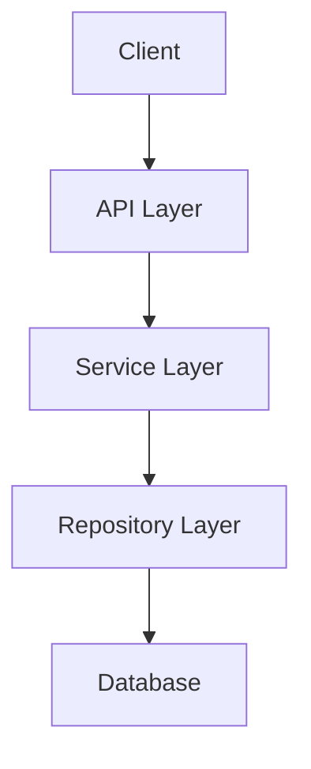

# Memory Bank Management: Initialize, Validate, and Update

## Context
- **Repository Path**: {repo_path}
- **Language**: {language}
- **Custom Rules**: {custom_rules}
- **JIRA Context**: {jira_context}

## Instructions

Your task is to manage the project's Memory Bank based on the Cursor's Memory Bank (v1.2 Final) structure. There are THREE operating modes:

1. **Initialize** - Create new Memory Bank from scratch
2. **Validate** - Verify existing Memory Bank structure
3. **Update** - Update Memory Bank with changes from current MR (PRIMARY MODE)

### Step 1: Check for Existing Memory Bank

Search for a `memory-bank/` directory in the repository root:

```bash
cd {repo_path}
ls -la | grep memory-bank
```

**Decision Flow**:
- If `memory-bank/` **EXISTS** → Proceed to **Step 2: Update Memory Bank with MR Changes**
- If `memory-bank/` **DOES NOT EXIST** → Proceed to **Step 4: Initialize New Memory Bank**

---

## Step 2: Update Memory Bank with MR Changes (PRIMARY MODE)

**IMPORTANT**: This is the PRIMARY mode when Memory Bank exists. Update it based on changes in the current MR.

### 2.1 Analyze MR Changes

Use `git diff` to identify all changes:

```bash
cd {repo_path}
# Get changed files
git diff --name-only origin/develop

# Get detailed diff
git diff origin/develop

# Get commit messages
git log --oneline origin/develop..HEAD
```

Analyze:
- What files were added/modified/deleted?
- What features/functionality was added?
- Were there architectural changes?
- Were new technologies/libraries introduced?
- Were new patterns or conventions established?
- Were there bug fixes or improvements?

### 2.2 Determine What to Update

Based on MR analysis, identify which Memory Bank files need updates:

| File | Update When |
|------|------------|
| **activeContext.md** | ALWAYS - Add to "Recent Changes", update "Current Focus" |
| **systemPatterns.md** | New architectural decisions, design patterns, component changes |
| **techContext.md** | New dependencies, technologies, tools, environment changes |
| **progress.md** | New features completed, status updates, known issues |
| **productContext.md** | Rarely - only if product vision or features change significantly |
| **projectbrief.md** | Very rarely - only if project scope changes |
| **changelog.md** | ALWAYS - Add entry for this MR |

### 2.3 Update Memory Bank Files

For each file that needs updating:

#### activeContext.md (MANDATORY UPDATE)

Add to "Recent Changes" section:

```markdown
### Recent Changes (YYYY-MM-DD)

Latest modifications from MR #{mr_iid}:

#### [Category: New Features / Bug Fixes / Improvements]
- **Added/Changed/Fixed**: [Description]
  - [Details from MR]
  - [Files affected]
  
[Keep previous changes, limit to last 3-4 MRs]
```

Update "Current Focus" if needed:
- What's currently being worked on
- Next steps based on this MR

Update "Active Decisions" if MR introduced new decisions:
```markdown
### Decision: [Decision Name]

**Context**: [Why this decision was made in this MR]

**Decision**: [What was decided]

**Rationale**:
- [Reason 1]
- [Reason 2]

**Implementation**:
- [How it was implemented in this MR]
- [Affected files/components]
```

#### systemPatterns.md (UPDATE IF ARCHITECTURAL CHANGES)

Update if MR contains:
- New design patterns
- Architectural changes
- New components or services
- Changes to component relationships
- New critical implementation paths

Add or update sections:
```markdown
## Key Technical Decisions

### [Decision Number]. [Decision Name]
- **Decision**: [What was decided in this MR]
- **Rationale**: [Why - from MR context]
- **Impact**: [How it affects the system]
- **MR**: #{mr_iid}
```

#### techContext.md (UPDATE IF NEW TECH/DEPENDENCIES)

Update if MR contains:
- New dependencies in pom.xml/build.gradle/package.json
- New environment variables
- New tools or frameworks
- Changes to development setup

Update relevant sections:
```markdown
### Key Dependencies
- [New Dependency]: [Purpose] - Added in MR #{mr_iid}
```

#### progress.md (UPDATE IF FEATURES/STATUS CHANGED)

Update "What Works" if new features completed:
```markdown
### Implemented Features
- ✅ [Feature Name] - Completed in MR #{mr_iid}
```

Update "Known Issues" if MR fixes or introduces issues:
```markdown
## Known Issues

1. **[Issue Name]**
   - Severity: High/Medium/Low
   - Impact: [Description]
   - Status: Resolved in MR #{mr_iid} / Open
```

Update "Evolution of Decisions":
```markdown
| YYYY-MM-DD | [Decision] | [Rationale] | ✅ Implemented in MR #{mr_iid} |
```

#### changelog.md (MANDATORY UPDATE)

ALWAYS add an entry for this MR:

```markdown
## [Unreleased]

### Added (MR #{mr_iid})
- [New features from this MR]

### Changed (MR #{mr_iid})
- [Changes to existing functionality]

### Fixed (MR #{mr_iid})
- [Bug fixes from this MR]
```

### 2.4 Output Format for Updates

```yaml
memory_bank_status: UPDATED
mr_analyzed: {mr_iid}
files_updated:
  - file: activeContext.md
    changes: "Added recent changes, updated current focus"
  - file: systemPatterns.md
    changes: "Documented new authentication pattern"
  - file: techContext.md
    changes: "Added new Redis dependency"
  - file: progress.md
    changes: "Marked user authentication feature as completed"
  - file: changelog.md
    changes: "Added MR entry to unreleased section"

update_summary:
  features_added: 
    - "User authentication with JWT"
  patterns_introduced:
    - "Token-based authentication pattern"
  dependencies_added:
    - "spring-security: 6.2.0"
  issues_resolved:
    - "Fixed null pointer in user service"

recommendations:
  - "Consider adding authentication documentation to productContext.md"
  - "Update systemPatterns.md with security best practices"
```

### 2.5 Write Updated Memory Bank Files

**IMPORTANT**: You must WRITE the updated content directly to Memory Bank files. FastAPI will handle commit and push.

For each file you updated, write the changes:

```bash
cd {repo_path}

# Write updated content to files
# Example for activeContext.md:
cat > memory-bank/activeContext.md << 'EOF'
[... full updated content ...]
EOF

# Example for changelog.md:
cat >> memory-bank/changelog.md << 'EOF'

## [Unreleased]

### Added (MR #{mr_iid})
- [New features from this MR]
...
EOF
```

**Critical Requirements**:
1. **WRITE to files**, don't just suggest changes
2. Write COMPLETE file content (not diffs)
3. Preserve existing structure and formatting
4. Only modify Memory Bank files (`memory-bank/*.md`)
5. Don't touch any code files

**Return in JSON**:
```json
{
  "files_modified": [
    {
      "file": "memory-bank/activeContext.md",
      "action": "updated",
      "summary": "Added recent changes for MR #{mr_iid}"
    },
    {
      "file": "memory-bank/changelog.md",
      "action": "updated",
      "summary": "Added MR entry to unreleased section"
    }
  ]
}
```

**What FastAPI will do after you finish**:
- Detect modified files in `memory-bank/`
- Stage changes: `git add memory-bank/`
- Commit: `git commit -m "docs: Update Memory Bank for MR #{mr_iid} [skip ci]"`
- Push to MR branch: `git push origin HEAD`

---

## Step 3: Validate Existing Memory Bank (RARELY USED)

**Note**: This step is for validation only (less common). For normal MR flow, use Step 2 (Update).

If Memory Bank exists but needs validation (rare case), verify it contains the required core files:

### Required Core Files
1. **`projectbrief.md`** - Foundation document
2. **`productContext.md`** - Why the project exists
3. **`activeContext.md`** - Current work focus
4. **`systemPatterns.md`** - System architecture
5. **`techContext.md`** - Technologies used
6. **`progress.md`** - What works, what's left

### Validation Checklist

For each required file:
- [ ] File exists
- [ ] File is not empty
- [ ] File has meaningful content (not just template)
- [ ] File structure follows Memory Bank conventions

### Validation Output

Report status for each file:

```yaml
memory_bank_status: EXISTS
validation_results:
  - file: projectbrief.md
    status: OK | MISSING | INCOMPLETE
    notes: "Contains project scope and requirements"
  
  - file: productContext.md
    status: OK | MISSING | INCOMPLETE
    notes: "Describes user experience and goals"
  
  - file: activeContext.md
    status: OK | MISSING | INCOMPLETE
    notes: "Up to date with recent changes"
  
  - file: systemPatterns.md
    status: OK | MISSING | INCOMPLETE
    notes: "Documents key architectural decisions"
  
  - file: techContext.md
    status: OK | MISSING | INCOMPLETE
    notes: "Lists all technologies and dependencies"
  
  - file: progress.md
    status: OK | MISSING | INCOMPLETE
    notes: "Tracks current project status"

recommendations:
  - "Update activeContext.md to reflect this MR"
  - "Add missing systemPatterns.md file"
```

If any files are MISSING or INCOMPLETE, provide suggestions for improvement.

---

## Step 4: Initialize New Memory Bank

If Memory Bank does NOT exist, create it from scratch by analyzing the project.

### Analysis Process

1. **Explore Repository Structure**:
```bash
cd {repo_path}
find . -type f -name "*.java" | head -20  # Get sample files
find . -type f -name "pom.xml" -o -name "build.gradle"  # Build files
find . -type f -name "README.md" -o -name "*.md" | head -10  # Documentation
ls -la src/  # Source structure
```

2. **Analyze Project**:
   - Read README.md if exists
   - Examine build configuration (pom.xml, build.gradle)
   - Check main application class
   - Identify key packages and modules
   - Check for existing documentation

3. **Identify Technologies**:
   - Programming language and version
   - Framework (Spring Boot, Quarkus, etc.)
   - Database (PostgreSQL, MySQL, etc.)
   - Build tool (Maven, Gradle)
   - Testing frameworks
   - Dependencies

### Memory Bank Template

Based on the Cursor's Memory Bank (v1.2 Final) structure, create the following files:

#### 1. `memory-bank/projectbrief.md`

```markdown
# Project Brief

**Version**: 1.0
**Last Updated**: [Current Date]

## Project Overview

[2-3 sentence description of what this project does]

## Core Objectives

1. [Primary objective]
2. [Secondary objective]
3. [Additional objectives]

## Scope

### In Scope
- [Feature/functionality 1]
- [Feature/functionality 2]
- [Feature/functionality 3]

### Out of Scope
- [What this project does NOT do]
- [Future considerations]

## Success Criteria

- [Measurable criteria 1]
- [Measurable criteria 2]
- [Measurable criteria 3]

## Changelog

| Version | Date | Summary |
|---------|------|---------|
| 1.0 | [Date] | Initial project brief created by AI analysis |
```

#### 2. `memory-bank/productContext.md`

```markdown
# Product Context

## Why This Project Exists

[Problem statement - what problem does this solve?]

## User Problems Solved

1. **[Problem 1]**: [Description]
2. **[Problem 2]**: [Description]
3. **[Problem 3]**: [Description]

## How It Works

[High-level explanation of the solution approach]

### Key Features

1. **[Feature 1]**
   - Description
   - User benefit

2. **[Feature 2]**
   - Description
   - User benefit

3. **[Feature 3]**
   - Description
   - User benefit

## User Experience Goals

- [UX goal 1]
- [UX goal 2]
- [UX goal 3]

## Target Users

- [User persona 1]
- [User persona 2]
```

#### 3. `memory-bank/systemPatterns.md`

```markdown
# System Patterns

## Architecture Overview

[Describe the overall architecture - layered, microservices, monolith, etc.]



## Key Technical Decisions

### 1. [Decision 1 - e.g., "REST API Design"]
- **Decision**: [What was decided]
- **Rationale**: [Why this decision]
- **Impact**: [How it affects the system]

### 2. [Decision 2]
- **Decision**: [What was decided]
- **Rationale**: [Why this decision]
- **Impact**: [How it affects the system]

## Design Patterns in Use

- **[Pattern 1]**: [Where and how it's used]
- **[Pattern 2]**: [Where and how it's used]
- **[Pattern 3]**: [Where and how it's used]

## Component Relationships

[Describe how major components interact]

## Critical Implementation Paths

### [Critical Path 1 - e.g., "User Authentication Flow"]
1. Step 1
2. Step 2
3. Step 3

### [Critical Path 2]
1. Step 1
2. Step 2
3. Step 3

## Package Structure

```
src/main/java/
├── com.example.project/
│   ├── api/          # REST controllers
│   ├── service/      # Business logic
│   ├── repository/   # Data access
│   ├── model/        # Domain entities
│   ├── config/       # Configuration
│   └── utils/        # Utilities
```
```

#### 4. `memory-bank/techContext.md`

```markdown
# Technical Context

## Technology Stack

### Core Technologies
- **Language**: [Java X.X, Python X.X, etc.]
- **Framework**: [Spring Boot X.X, FastAPI, etc.]
- **Database**: [PostgreSQL X.X, MySQL, etc.]
- **Build Tool**: [Maven, Gradle, npm, etc.]

### Key Dependencies
- [Dependency 1]: [Purpose]
- [Dependency 2]: [Purpose]
- [Dependency 3]: [Purpose]

## Development Setup

### Prerequisites
- [Prerequisite 1]
- [Prerequisite 2]

### Local Development
```bash
# Clone repository
git clone [repo-url]

# Install dependencies
[build command]

# Run application
[run command]

# Run tests
[test command]
```

## Technical Constraints

- [Constraint 1]
- [Constraint 2]
- [Constraint 3]

## Tool Usage Patterns

### Testing
- **Unit Tests**: [JUnit 5, pytest, etc.]
- **Integration Tests**: [TestContainers, etc.]
- **Mocking**: [Mockito, unittest.mock, etc.]

### Code Quality
- **Linter**: [Checkstyle, pylint, etc.]
- **Formatter**: [Spotless, Black, etc.]
- **Static Analysis**: [SonarQube, etc.]

## Environment Configuration

See `.env.template` for required environment variables:

```bash
# Database
DATABASE_URL=jdbc:postgresql://localhost:5432/mydb
DATABASE_USERNAME=user
DATABASE_PASSWORD=pass

# Application
SERVER_PORT=8080
LOG_LEVEL=INFO
```
```

#### 5. `memory-bank/activeContext.md`

```markdown
# Active Context

**Last Updated**: [Current Date]

## Current Focus

[What is currently being worked on - based on this MR analysis]

## Recent Changes

- [Change 1 from git log/diff analysis]
- [Change 2]
- [Change 3]

## Next Steps

Based on current state:
1. [Next step 1]
2. [Next step 2]
3. [Next step 3]

## Active Decisions and Considerations

### [Decision Topic 1]
- **Context**: [Why this decision is needed]
- **Options**: [Available options]
- **Recommendation**: [Suggested approach]

## Important Patterns and Preferences

- [Pattern/preference discovered from codebase analysis]
- [Pattern/preference discovered from codebase analysis]

## Learnings and Project Insights

### #architecture
[Insight about architecture]

### #best-practices
[Insight about coding practices]

### #testing
[Insight about testing approach]
```

#### 6. `memory-bank/progress.md`

```markdown
# Progress

**Last Updated**: [Current Date]

## What Works

Based on current codebase analysis:

### Implemented Features
- ✅ [Feature 1]
- ✅ [Feature 2]
- ✅ [Feature 3]

### Working Components
- [Component 1]: [Status/description]
- [Component 2]: [Status/description]

## What's Left to Build

### Planned Features
- ⏳ [Planned feature 1]
- ⏳ [Planned feature 2]

### Known Gaps
- [Gap 1]
- [Gap 2]

## Current Status

- **Build Status**: [Builds successfully / Has issues]
- **Test Coverage**: [High / Medium / Low / Unknown]
- **Documentation**: [Complete / Partial / Minimal]

## Known Issues

1. **[Issue 1]**
   - Severity: High/Medium/Low
   - Impact: [Description]
   - Status: Open/In Progress/Resolved

2. **[Issue 2]**
   - Severity: High/Medium/Low
   - Impact: [Description]
   - Status: Open/In Progress/Resolved

## Evolution of Decisions

### [Date] - [Decision]
- **What**: [What was decided]
- **Why**: [Reasoning]
- **Outcome**: [Result]

## Reference

For detailed changelog, see `memory-bank/changelog.md`
```

#### 7. Additional Files

Create these optional but recommended files:

**`memory-bank/changelog.md`**:
```markdown
# Changelog

All notable changes to this project.

## [Unreleased]

### Added
- Memory Bank initialized by AI Code Review System

## [Version] - YYYY-MM-DD
[Standard changelog format]
```

**`memory-bank/tags_index.md`**:
```markdown
# Tags Index

Quick navigation to tagged insights across Memory Bank files.

## #architecture
- [systemPatterns.md] - Architecture overview
- [activeContext.md] - Recent architectural decisions

## #best-practices
- [activeContext.md] - Coding standards discovered

## #testing
- [techContext.md] - Testing framework setup
- [activeContext.md] - Testing patterns
```

### Generation Instructions

1. **Analyze thoroughly**: Read as many project files as needed to build accurate Memory Bank
2. **Be specific**: Use actual project names, technologies, and patterns found in the code
3. **Use evidence**: Base all claims on actual code analysis, not assumptions
4. **Create directory**: `mkdir -p memory-bank/`
5. **Write files**: Create all 6 core files with actual content
6. **Use Mermaid**: Include diagrams where helpful

### Output Format

After creating Memory Bank:

```yaml
memory_bank_status: CREATED
files_created:
  - projectbrief.md
  - productContext.md
  - systemPatterns.md
  - techContext.md
  - activeContext.md
  - progress.md
  - changelog.md
  - tags_index.md

analysis_summary:
  project_type: "[e.g., REST API, Microservice, CLI Tool]"
  primary_technology: "[e.g., Spring Boot 3.2]"
  architecture_pattern: "[e.g., Layered Architecture]"
  key_features: 
    - "[Feature 1]"
    - "[Feature 2]"
  confidence: HIGH | MEDIUM | LOW

recommendations:
  - "Review and refine projectbrief.md with product owner"
  - "Update activeContext.md as work progresses"
  - "Add project-specific diagrams to memory-bank/diagrams/"
```

## Important Notes

1. **Quality over Speed**: Take time to analyze the project thoroughly
2. **Be Accurate**: Only document what you can verify from the codebase
3. **Mark Uncertainty**: If you're unsure about something, mark it with `[TODO: Verify]`
4. **Use Git History**: Check `git log` for project evolution insights
5. **Check Existing Docs**: Leverage README, CONTRIBUTING, and other existing documentation

## Memory Bank Purpose

The Memory Bank is not just documentation—it's a living context system that:
- Helps new developers understand the project quickly
- Preserves architectural decisions and their rationale
- Tracks project evolution and learnings
- Provides context for AI-assisted development
- Serves as a single source of truth for project knowledge

## Success Criteria

A good Memory Bank should:
- [ ] Be based on actual project analysis, not assumptions
- [ ] Use specific examples from the codebase
- [ ] Include actionable next steps
- [ ] Be maintainable (not too verbose)
- [ ] Provide clear value to developers
- [ ] Follow the Cursor's Memory Bank v1.2 structure

